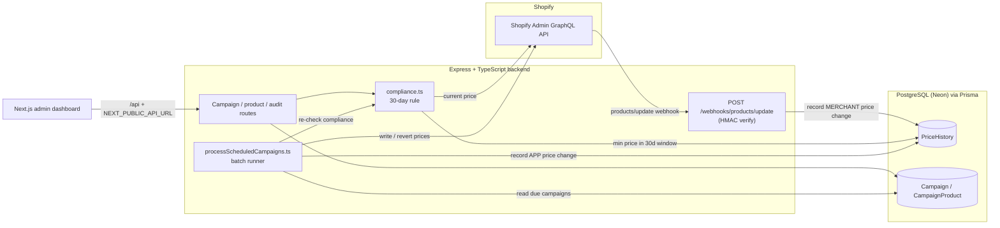

# Shopify Campaign Regulation App

A Shopify sale-campaign manager that enforces the **EU Omnibus / Norwegian _førpris_ (30-day lowest reference price) rule**: a scheduled sale cannot run unless each variant's advertised "before" price respects the lowest price actually recorded in the 30 days before the campaign starts.


---

## Overview

Merchants running promotions in the EU and Norway must show an honest reference price. When a product is put on sale, the struck-through "before" price may not be higher than the **lowest price the merchant charged during the previous 30 days**. This app tracks every price change for a Shopify catalogue, and blocks (or explicitly overrides, with justification) any sale campaign whose reference price would violate that rule.

It consists of a TypeScript/Express backend that owns the compliance logic and Shopify integration, and a separate Next.js admin dashboard for merchandisers to plan campaigns and see violations before they publish.

## The problem

The **EU Omnibus Directive (2019/2161)**, implemented in Norway through the price-marketing regulations (_prisopplysningsforskriften_ / _førpris_ rules), requires that any advertised price reduction reference the lowest price applied in at least the 30 days prior to the reduction. Getting this wrong exposes merchants to regulatory penalties and misleading-marketing claims.

Shopify has no built-in enforcement of this rule. A merchant can freely set a `compareAtPrice` that overstates the historical price. This project closes that gap by:

- continuously recording the real price history of each variant, and
- validating every planned campaign against that history before it can go live.

> This project is an engineering tool to support compliance workflows. It is not legal advice; merchants remain responsible for their own regulatory obligations.

## The solution

- **Record price history** from Shopify `products/update` webhooks (HMAC-verified) and from the app's own price writes, into a `PriceHistory` table.
- **Validate campaigns** against the 30-day low at three points: at creation, at scheduled activation, and via an on-demand catalogue audit.
- **Apply and expire campaigns** automatically with a batch runner that writes discounted prices back to Shopify and reverts them when the campaign ends.
- **Give merchandisers a dashboard** to search products, plan discounts, and see exactly which variants fail the rule and why — with an explicit, justification-gated override for edge cases.

## Key features

- 30-day lowest-price compliance engine (`validateVariantsForCampaign`) with two violation reasons: `NO_HISTORY` and `COMPARE_ABOVE_30D_LOW`.
- Enforcement at campaign **creation** (HTTP 422 with structured violations), at **scheduled activation** (a safety re-check that keeps non-compliant campaigns in `DRAFT`), and via an **on-demand audit** endpoint over the whole catalogue.
- HMAC-verified Shopify webhook ingestion of merchant price changes.
- Automated apply/expire runner using `productVariantsBulkUpdate`.
- Admin dashboard: campaign list (All / Active / Draft / Finished tabs), campaign create (product search, discount %, dates), campaign detail, and a products explorer.
- Explicit "Override the 30-day price rule" flow that requires a written justification in the UI.

## Architecture



## Technology stack

| Layer            | Technology                                                        |
| ---------------- | ----------------------------------------------------------------- |
| Backend          | Node.js, TypeScript, Express                                      |
| Shopify          | Admin GraphQL API (2024-10) via `graphql-request`; OAuth (offline token) |
| Database / ORM   | PostgreSQL (Neon) via Prisma                                      |
| Admin dashboard  | Next.js (pages router, static export), React, Tailwind CSS       |
| Tooling          | ESLint, Prettier, Vitest, GitHub Actions CI                      |

## Data model

Prisma models (`prisma/schema.prisma`):

- **`PriceHistory`** — the backbone of the rule. Each row is a price observation for a variant: `variantId`, `price`, optional `compareAtPrice`, `changedAt`, and `changedBy` (`APP` or `MERCHANT`). Merchant rows come from webhooks; app rows come from the campaign runner. The 30-day check queries the minimum `price` per variant within the window.
- **`Campaign`** — `name`, `type` (`SALE` / `CONDITIONAL`), `startAt`, `endAt`, `discountLogic` (JSON), and `status` (`DRAFT` → `SCHEDULED` → `ACTIVE` → `FINISHED`).
- **`CampaignProduct`** — join between a campaign and the variant IDs it targets.
- **`Product`** / **`Variant`** — a local mirror of the Shopify catalogue (Shopify GIDs, titles, prices) used to drive product search and the audit.
- **`Shop`** — installed shop domain, offline access token, and scopes (populated by OAuth).

## Compliance logic

The core check lives in `src/compliance.ts`:

`validateVariantsForCampaign(variantIds, startAt)`

1. Compute the window: the 30 days **before** `startAt` (`[startAt − 30d, startAt)`).
2. Query the minimum recorded `price` per variant in that window (`priceHistory.groupBy`).
3. Fetch each variant's current price from Shopify (the value that would become the "before" / compare-at price).
4. Emit a violation when:
   - **`NO_HISTORY`** — there is no recorded price for the variant in the window, so the reference price cannot be substantiated; or
   - **`COMPARE_ABOVE_30D_LOW`** — the current price is strictly greater than the 30-day low.

An empty result means compliant. The same function guards three call sites: `createCampaign.ts` (returns HTTP 422 with the violations), `processScheduledCampaigns.ts` (re-checks at activation and keeps failing campaigns in `DRAFT`), and `compliance/auditRoute.ts` (catalogue-wide audit).

**Override flow.** The dashboard exposes an "Override the 30-day price rule" checkbox. When enabled it requires a written justification (the submit button stays disabled until one is entered) and only suppresses the two overridable reasons above; other validation still applies. See _Known limitations_ regarding persistence of the justification.

## Getting started

Prerequisites: Node.js 20+, npm, and a PostgreSQL database (e.g. a Neon project).

### Backend

```bash
# from the repo root
npm install
cp .env.example .env        # then fill in real values
npx prisma generate
npx prisma migrate dev      # create the schema in your database
npm run dev                 # start the Express server (ts-node-dev)
```

Other useful scripts: `npm run build` (compile to `dist/`), `npm start` (run the build), `npm run sync:catalog` (full catalogue sync from Shopify). To activate/expire due campaigns, run the batch processor on a schedule:

```bash
npx ts-node src/processScheduledCampaigns.ts
```

### Admin dashboard

```bash
cd admin-dashboard
npm install
cp .env.example .env.local  # adjust NEXT_PUBLIC_API_URL if needed
npm run dev                 # Next.js dev server
```

## Environment variables

Backend (`.env`, see `.env.example`):

| Variable                | Required | Description                                                             |
| ----------------------- | -------- | ----------------------------------------------------------------------- |
| `DATABASE_URL`          | yes      | PostgreSQL connection string used by Prisma.                            |
| `SHOPIFY_API_KEY`       | yes      | Shopify app API key (OAuth).                                            |
| `SHOPIFY_API_SECRET`    | yes      | Shopify app secret; also used to verify webhook HMAC.                   |
| `SHOP_DOMAIN`           | yes      | Target shop's `*.myshopify.com` domain (no protocol).                  |
| `SHOPIFY_ACCESS_TOKEN`  | yes      | Offline Admin API access token for `SHOP_DOMAIN`.                       |
| `APP_URL`               | yes      | Public base URL of the backend (OAuth callback, webhook callback, CORS).|
| `PORT`                  | no       | Port for the Express server (defaults to `3000`).                       |

Admin dashboard (`admin-dashboard/.env.local`, see `admin-dashboard/.env.example`):

| Variable               | Required | Description                                        |
| ---------------------- | -------- | -------------------------------------------------- |
| `NEXT_PUBLIC_API_URL`  | no       | Base URL of the backend API for direct calls.      |

## Testing

Unit tests for the compliance engine run with [Vitest](https://vitest.dev/), fully mocking the Prisma and Shopify clients so no database or network is required:

```bash
npm test
```

Covered cases: empty input short-circuit, correct 30-day-before-start window, `NO_HISTORY`, `COMPARE_ABOVE_30D_LOW`, and compliant cases at and below the 30-day low (6 tests). There are currently no integration or end-to-end tests.

## Security & privacy

- **Webhook authenticity.** Incoming `products/update` webhooks are verified with an HMAC-SHA256 signature against `SHOPIFY_API_SECRET` before any data is persisted (`src/webhookVerifier.ts`).
- **Secrets via environment.** All credentials are read from environment variables; `.env` files are gitignored and only `.env.example` templates (with dummy values) are committed.
- **⚠️ Rotate previously committed credentials.** An earlier `.env` file was committed and later deleted, so real credentials still exist in the **git history**: the Shopify **API key** and **API secret**, and the **Neon `DATABASE_URL`**. The current working tree is clean, but history was intentionally **not** rewritten here. The repository owner should **rotate these secrets** (regenerate the Shopify app credentials and the Neon database password) so the exposed values are useless. No secret values are reproduced in this repository's documentation.

## Known limitations

- **Override justification is not persisted.** On the backend, an accepted override is only `console.warn`'d, not written to the database (`src/campaigns/create/createCampaign.ts`). A durable audit log is a natural follow-up.
- **OAuth `state` check is a TODO.** `src/auth/oauth.ts` generates and stores a `state` value but does not yet compare it on callback, leaving a CSRF gap in the install flow.
- **Dashboard API wiring is inconsistent.** Some pages call the backend directly via `NEXT_PUBLIC_API_URL`; others use relative `/api/*` paths that rely on a Next.js rewrite (`next.config.js`) targeting port 10000 — and rewrites are not applied under `output: 'export'`. This should be unified.
- **Single-shop environment fallback.** Although shops and tokens are stored per-shop in the `Shop` table, several modules still fall back to `SHOP_DOMAIN` / `SHOPIFY_ACCESS_TOKEN` from the environment, so multi-tenant operation is only partial.
- **Some dashboard dependencies are pinned to `latest`.** `admin-dashboard/package.json` uses `latest` for `next`, `react`, and `typescript`, which is not reproducible; these should be pinned.

## Project status

Portfolio / work-in-progress. The core compliance engine, webhook ingestion, campaign scheduling, and admin dashboard are functional; the items under _Known limitations_ are the main areas for hardening.

## License

No license file is currently included, so the code is "all rights reserved" by default. If you intend this to be reusable, add a license (e.g. MIT).
